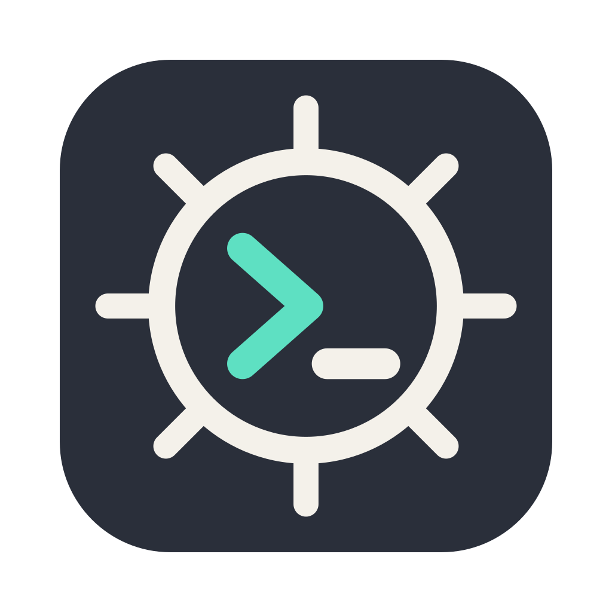
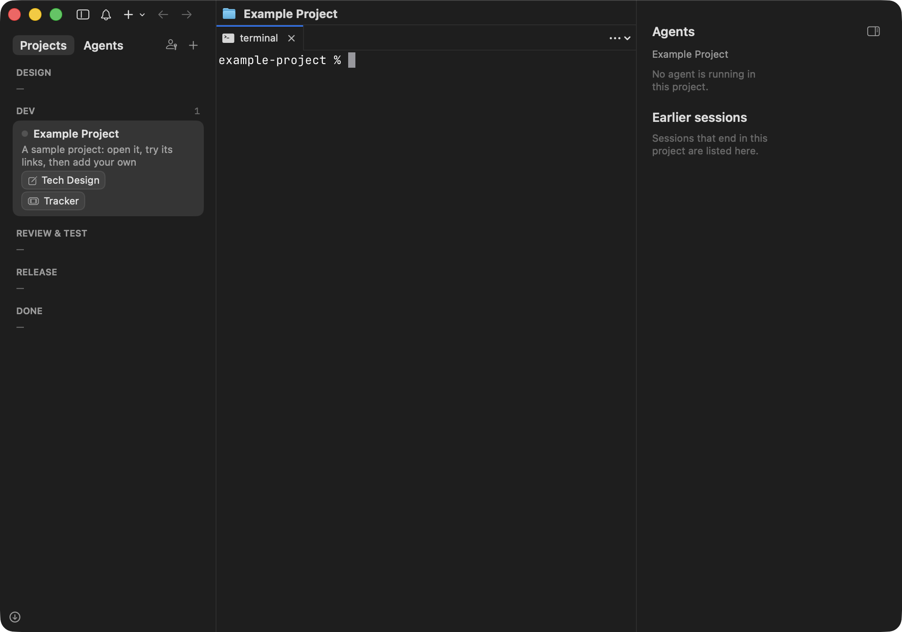
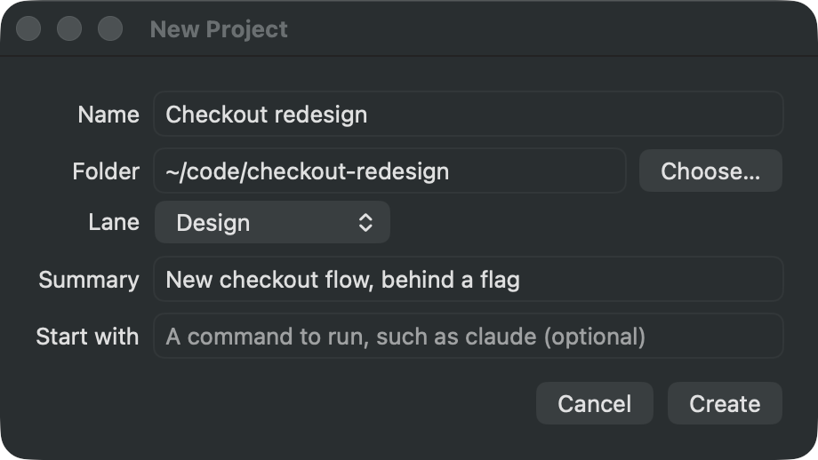
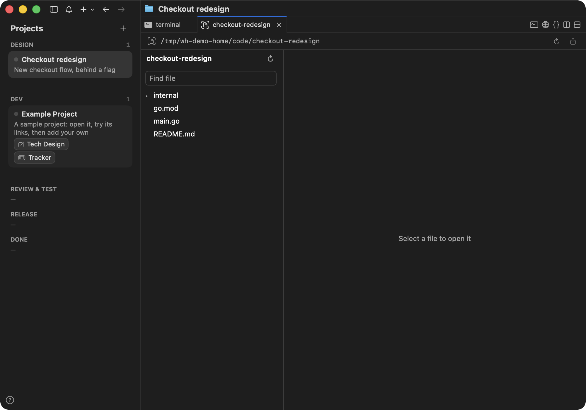
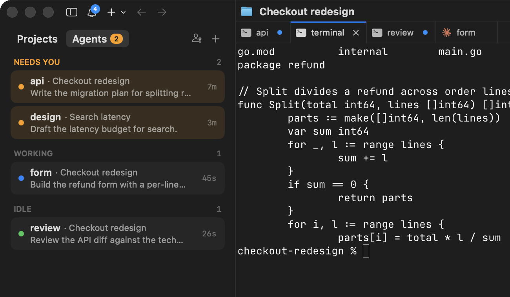
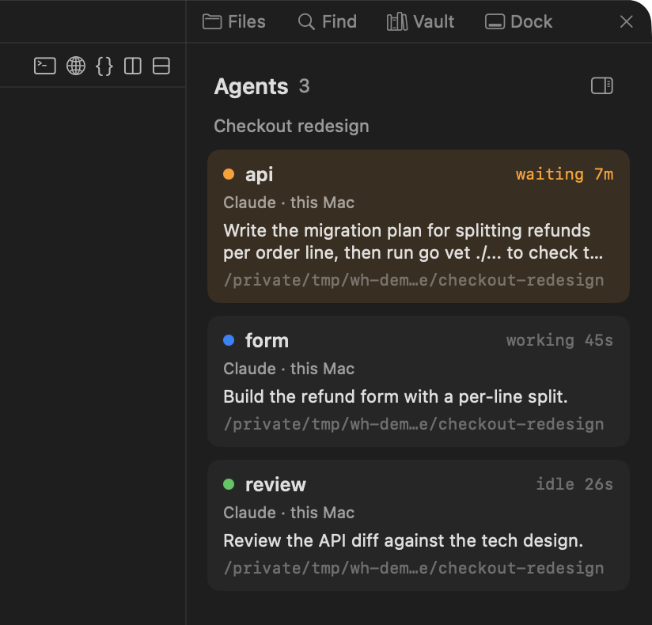

<p align="center">
  
</p>

<h1 align="center">Wheelhouse IDE</h1>

<p align="center">
  One window for every project you have in flight:<br>
  a board of projects, and for each one a workspace with its terminals, AI coding agents, browser tabs and code.
</p>

Wheelhouse IDE is a macOS app built on [cmux](https://github.com/manaflow-ai/cmux), the
Ghostty-based terminal for AI coding agents. It keeps everything cmux does and adds a project
board, a code editor with language servers, and editing on remote hosts.

```
Projects
DESIGN            1
  ● Checkout redesign
    Tech design in review
DEV               2
  ● Search indexing        2 waiting on you
    feat/reindex* · #482 · 3 agents
  ● Billing export         remote
    feat/export · 60%
REVIEW & TEST     —
RELEASE           1
  ● Mobile login
    Rollout 50% → 100% Wednesday
DONE              —
```

## Features

- **Project board.** A kanban board in the sidebar: one card per project, in lanes from Design to
  Done. A card shows its branch and pull request, how many agents are running and how many are
  waiting on you, and links to the project's documents. Click a card to jump into its workspace;
  drag it to another lane as the work moves on.
  The links open in the app's browser, and one button copies your sign-ins from Chrome so that
  they open signed in.
- **Many agents per project.** The board's Agents view lists every agent across your projects
  by what it is doing, with the ones waiting on you first. While a project is selected, an
  Agents panel on the right shows each of its agents with its task and sub-agents; it collapses
  to an Agents button in the title bar. Agents on SSH hosts are listed with the local ones.
- **Session history per project.** Every agent session started in a project is kept after it
  ends: which harness ran it, what it was asked first, when and for how long. The Agents panel
  lists them under the running agents; Resume opens a session again in a new tab with the
  harness's own resume command, and each has a `wheelhouse://` link to paste elsewhere. Claude
  Code and Codex are recognised as they come; any other harness takes a few lines of JSON.
- **Code editor.** Text files open in [Monaco](https://microsoft.github.io/monaco-editor/), the
  editor from VS Code: syntax highlighting for about 80 languages, multiple cursors, find and
  replace, folding and a minimap.
- **Folder tabs.** Open a folder as one tab with a file tree, a strip of open files, find a file
  by name, search inside files, and create, rename and delete from the tree.
- **Language servers.** Completion, hover, go to definition, references, rename and diagnostics.
  Go works out of the box with `gopls`; any other LSP server can be added with one setting.
- **Remote hosts.** Open a folder on another machine over SSH. Files are edited and saved there,
  and the language server runs there. For this the host needs only `python3`.
- **Agent notifications from SSH hosts.** A small Claude Code hook tells you when an agent on a
  remote machine needs input or has finished.
- **Everything in cmux.** Workspaces, splits, notifications, the in-app browser and the `cmux`
  command work as they do upstream, and the
  [cmux documentation](https://cmux.com/docs/getting-started) applies.

## Install

1. Download `Wheelhouse-IDE-<version>-macos-universal.zip` from the
   [latest release](https://github.com/RuchikG/Wheelhouse-IDE/releases/latest) and unzip it.
2. Move `Wheelhouse IDE.app` to your Applications folder and open it.
3. macOS blocks it the first time, because the build is not signed with an Apple Developer ID.
   Open System Settings → Privacy & Security, find the message about Wheelhouse IDE and click
   "Open Anyway".

It needs macOS 14 or later and runs on Apple silicon and Intel. The app has its own settings and
runs next to an installed cmux without touching it.

**Updating.** From version 0.1.4 the app updates itself. When a newer version is out, an
"Update Available" button appears at the foot of the sidebar; click it, then Install and
Relaunch, and the app downloads the version, installs it and opens again, without another trip
to System Settings. The button there looks for a new version when you click it, and the app
looks by itself once an hour. To get from 0.1.3 or earlier to a version that does this, download
the latest release once more and replace the app.

To build it yourself, see [Building from source](wheelhouse/docs/building.md).

## Getting started

Open the app. The first launch sets up the board by itself: the lanes, the board as the left
sidebar, and an **Example Project** to look around in.

<p align="center">
  
</p>

1. **Look around.** Click the Example Project card to jump into its workspace. The chips on the
   card open its links as browser tabs. Drag the card to another lane as the work moves on.
2. **Add your project.** Click the **+** at the top of the board, give the project a name and
   pick its folder. It opens in its own workspace, in the lane you chose.

   <p align="center">
     
   </p>

3. **Open its code.** Click the curly-braces button at the top right of a pane and choose
   "Open Folder…". The folder opens as a tab with its file tree. ⌘P finds a file by name and
   ⇧⌘F searches inside the files.

   <p align="center">
     
   </p>

4. **Stay signed in.** Link tabs have their own cookies. Click the key button at the top of the
   board to copy your sign-ins from Chrome or another browser, so the pages behind a sign-in
   open as they do there. macOS asks once for access to the browser's key in your keychain.
5. **Run several agents.** Start an agent in each tab you need. **Agents** at the top of the
   board lists every agent in every project by what it is doing, the ones waiting on you first;
   click one to go to it.

   <p align="center">
     
   </p>

   While a project is selected, the Agents panel is open on the right with each agent's state
   and task. Its button collapses it to an Agents button in the title bar, which opens it
   again. Under the agents it lists the project's
   earlier sessions: **Resume** opens one again in a new tab, and the link button copies a
   `wheelhouse://` link to it.

   <p align="center">
     
   </p>

That is all a local project needs. More in [Project board](wheelhouse/board/README.md) and
[Code editor](wheelhouse/docs/editor.md).

### Working on a remote host

Run `cmux ssh <host>` in the app to open a workspace on that machine (this installs cmux's
remote daemon there), then choose "Open Folder…": it asks for a path on the host. If the
connection fails, see [Folders on a remote host](wheelhouse/docs/editor.md#folders-on-a-remote-host).

cmux can also show whether the agents in a `cmux ssh` workspace are working or waiting for you.
That needs its hooks in the host's Claude Code and Codex settings, so Wheelhouse IDE leaves it
off until you ask:

```sh
defaults write com.cmuxterm.app.staging.wheelhouse wheelhouse.remoteAgentHooks.enabled -bool true
```

Read [what it changes on the host](wheelhouse/docs/fork.md#agent-hooks-on-ssh-hosts) first.

The `cmux` command works in the app's terminals as it does in cmux.

## Documentation

| Topic | |
| --- | --- |
| [Code editor](wheelhouse/docs/editor.md) | Editing, folder tabs, remote folders, language servers, known limits |
| [Project board](wheelhouse/docs/board.md) | How the board works and how it maps onto cmux |
| [Board set-up and the `proj` command](wheelhouse/board/README.md) | Lanes, project files, links, worktrees, settings |
| [Notifications from SSH hosts](wheelhouse/remote-notify/README.md) | Installing the hook on a remote machine |
| [Building from source](wheelhouse/docs/building.md) | Requirements, build tags, the command line |
| [How the fork differs from cmux](wheelhouse/docs/fork.md) | Privacy, naming, where the code is, merging upstream |

## Roadmap

What we plan to work on next, roughly in this order within each area.

**Project board**

- Show status from outside tools on the card: the state of its tracker item and of its
  pipeline, not only the link to them.
- Resume sessions on SSH hosts from a project's history; today they are listed without it.
- Manage git worktrees for projects on remote hosts, and open a remote project's folder from
  its card.
- A project agent: one agent per project that knows the project's links, repositories and
  lane, and can be asked to move the work along.

**Code editor**

- Remember which folders were expanded, and show the open file in the tree.
- Save single remote files back to their host (today a remote folder tab is needed).
- Bring language features back by themselves after a dropped connection to a host.

**Install and updates**

- Builds signed with an Apple Developer ID, so macOS opens the app without the extra approval.

**Later**

- Following a project's agents from a phone.

Ideas and bug reports are welcome in the
[issue tracker](https://github.com/RuchikG/Wheelhouse-IDE/issues).

## Relationship to cmux

Wheelhouse IDE is an independent fork. It is not affiliated with or supported by Manaflow, the
company behind cmux.

- The build turns off cmux's analytics, crash reports and feature-flag requests, so none of
  them reach cmux.
- Sign-in, cloud machines and phone pairing are Manaflow services and are switched off.
- cmux's Computer Use, which lets agents click and type in other apps, is off until you turn
  it on.
- Its changes are kept small and separate so that upstream cmux can be merged regularly.

Details are in [How the fork differs from cmux](wheelhouse/docs/fork.md).

## License

Wheelhouse IDE is licensed like cmux: GPL-3.0-or-later for the app, CLI and packages, with the
server directories listed in [LICENSE](LICENSE) under the Business Source License 1.1. cmux is
copyright Manaflow, Inc. and its contributors; see
[THIRD_PARTY_LICENSES.md](THIRD_PARTY_LICENSES.md) for bundled dependencies. Monaco Editor is
MIT-licensed, copyright Microsoft Corporation.
